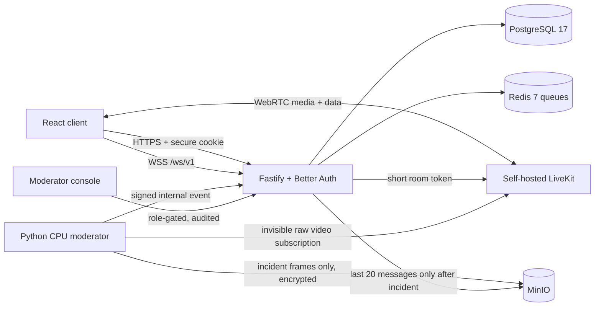

# Architecture

Each match receives a unique private LiveKit room. Two visible users can publish; the hidden moderation service is the only third participant. Queue entries begin with exact country and language, relax country at ten seconds, and remain same-language globally after thirty seconds. Atomic Redis claims and active-user keys prevent double matches.

The moderation window keeps five sampled frames (15 seconds at one frame every three seconds) in RAM. Normal windows disappear without persistence. A detection or report may retain at most three encrypted frames and twenty chat messages for 30 days.
